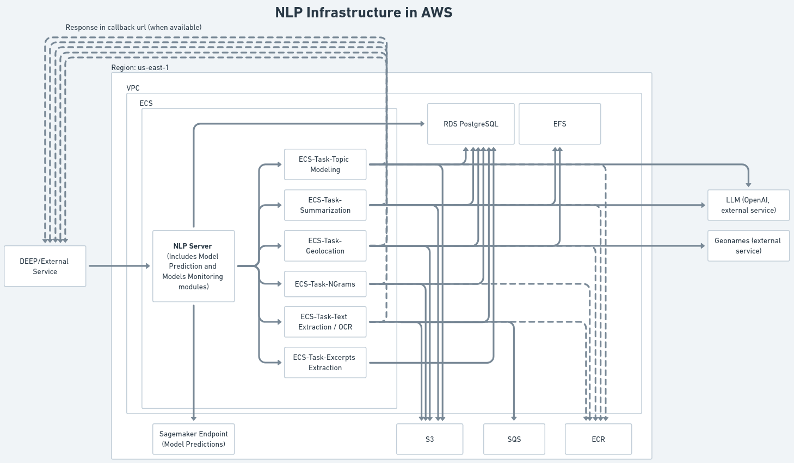
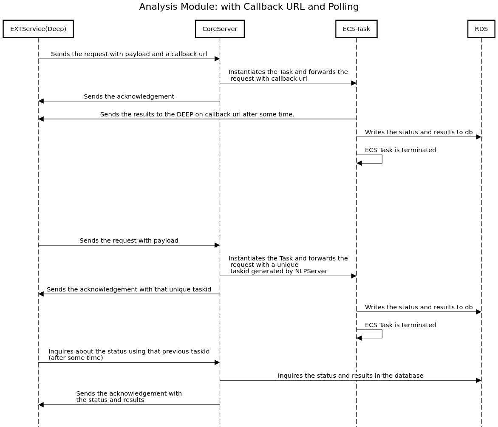

# NLP Infrastructure

The NLP Infrastructure deployed in AWS Cloud environment hosts modules such as NLP Server, different NLP specific modules related to Topic Modeling, Summarization, NGrams, Geolocations which are part of the Analysis Framework in DEEP. Alongside, it also hosts the Model Monitoring module for tracking the performance of the models. The model prediction is another feature served through this infrastructure. These services are all exposed through REST APIs.

The infrastructure components and resources are built using Terraform which is an Infrastructure as Code (IaC) tool for rapid deployment.

## Architecture
To begin with the architecture design, Elastic Container Service(ECS) is chosen which is a container orchestration service that runs and manages Docker containers. The ECS cluster comprises different services such as NLP Server, Topic Modeling, Summarization, NGrams, Geolocations, Text Extraction, Entry Extraction etc. These services further break down to a lower level to run the tasks. These tasks run the containers whose images are stored in the Elastic Container Registry(ECR). These containers are standalone units which execute the code and the results are returned.

There are many other AWS services being used which are the integral part of the NLP architecture such as VPC for private network, S3 for cloud storage, Route53 for domain management, ALB for sharing the load, Sagemaker for running the classification model etc.

## NLP Server
The NLP Server is the main entry point to access all the above mentioned services as it exposes several endpoints which are REST based. Those endpoints are protected with token based authentication. Upon request, the server administrator can create a token which can be used in requests to access the services. This server is written in Django which is a popular and powerful Python framework.

## Requests to NLP Server
The NLP Server is capable of accepting two types of requests from external services(e.g. DEEP)
- Callback url based
- Polling based

In a Callback based request, the client must include a callback url so that whenever the processing is complete, the response payload is sent to the client on that callback url. This is basically an asynchronous type of request which means the client needn't wait for the response and continue to do other sorts of jobs. Also note that all the status are written and updated in the database. This type of communication is being used when interacting with the DEEP system.

In a Polling based request, the client receives an unique id in the acknowledgement response from the server. Then, the client needs to keep on sending the request along with that unique id to keep track of the completion of the job. Also note that all the status are written and updated in the database. Once the job is done, the client will receive the payload(result) in one of the latter responses.


### Request/Task Status
The NLP Server sets four types of task status which is being maintained during the processing of the requests.
- INITIATED (id: 1)
- SUCCESS (id: 2)
- FAILED (id: 3)
- INPUT_URL_PROCESS_FAILED (id: 4)

When the request is received, the job is assigned an INITIATED status.
When the request is successfully processed, the job is assigned a SUCCESS status
When the request is failed due to various reasons, the job is assigned a FAILED status
When the request contains an invalid url and NLP server cannot process it, the job is assigned a INPUT_URL_PROCESS_FAILED status

For some reason if the request on the callback url fails (maybe the client’s listener is not responding or so), the NLP server can retry to send the response payload later.

Please find below the NLP Infrastructure and Sequence Diagrams of the deployed system.





# Deployment in AWS

In order to deploy in AWS, we simply run the following commands for staging and production env. deployments. In our case, the production env. deployment is automated using the github actions workflow.

## Staging
In order to run it in staging, you need to create a aws profile and set it here in these lines:
1. https://github.com/the-deep-nlp/core-server-infra/blob/2765e669ee6fb84fdded5aa5404a9f9e0d198ea2/main.tf#L15
2. https://github.com/the-deep-nlp/core-server-infra/blob/2765e669ee6fb84fdded5aa5404a9f9e0d198ea2/main.tf#L21

The aws profile should have all the needed permissions to access various resources in AWS.

For the staging, the images of all the modules should be loaded to the ECR manually and the respected names should be mentioned in the staging.tfvars file.
Then, if you run the below command, it will deploy all the required components in the AWS Infrastructure.

```$ terraform apply -var-file=staging.tfvars```

## Production
In Production environment, all the required access are setup in github actions as Secrets. Whenever new updates are pushed to the **release** branch, an approval is required from the administrator and once approved, the CI/CD in **Github Actions** run the sequence to create the docker images and uploads those images to the respective image repositories in ECR. Then, the terraform apply command deploys all the components to the AWS Infrastructure automatically, so, no need to run anything manually. Just for your reference, the main command that gets executed when deploying components is shown below.

```$ terraform apply -var-file=prod.tfvars```


